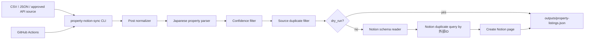

# Facebook Auto Post + Community Property Notion Sync

Facebookページへの自動投稿に加えて、所属コミュニティで共有された物件情報をCSV/JSONなどの許可済みデータソースから読み込み、物件らしい投稿だけを抽出してNotionへ集約するPython CLIです。

> 重要: Metaは2024年4月22日以降、Facebook Groups APIの広範な第三者アクセスを廃止しています。このリポジトリはFacebookグループ画面のスクレイピング、ログイン迂回、非公開グループの無断取得を行いません。取り込み元は、本人が利用権限を持つCSV/JSON、手動エクスポート、メール転送、Webhook、または明示的に承認されたAPIに限定します。

## 追加された機能

- コミュニティ投稿CSV/JSONの読み込み
- 日本語の物件投稿から以下を抽出
  - 物件名、家賃、間取り、最寄駅、徒歩分、面積、住所、タグ、投稿URL、投稿本文
- 物件らしさスコアによる雑談投稿の除外
- 投稿URLまたは本文ハッシュによる重複排除
- Notion Data Sourceへのページ作成
- Notion側の既存 `外部ID` チェックによる二重登録防止
- GitHub Actionsによる手動実行・定期実行・成果物アップロード
- 既存のFacebookページ投稿機能は維持

## まず動作確認

```bash
python -m pip install -e ".[dev]"
property-notion-sync --dry-run --source samples/community_posts.csv
```

`outputs/property-listings.json` に抽出結果が出力されます。サンプルでは物件投稿2件が抽出され、雑談投稿1件は低スコアとして除外されます。

## Notionに同期するための最小設定

Notion側にData Sourceを1つ作り、以下のプロパティを用意してください。全部そろっていなくても存在する列だけに書き込みますが、`物件名` と `外部ID` は強く推奨です。

| プロパティ名 | 型 | 用途 |
|---|---|---|
| 物件名 | Title | ページタイトル |
| 外部ID | Rich text | 重複判定キー |
| コミュニティ | Rich text | 取得元コミュニティ |
| 投稿日 | Date | 投稿日時 |
| 投稿URL | URL | 元投稿リンク |
| 家賃 | Number | 円単位の家賃 |
| 間取り | Rich text | 1K / 1LDK など |
| 最寄駅 | Rich text | 駅名 |
| 徒歩分 | Number | 駅徒歩分 |
| 面積㎡ | Number | 専有面積 |
| 住所 | Rich text | 抽出住所 |
| タグ | Multi-select | ペット可、即入居など |
| 本文 | Rich text | 元投稿本文 |
| 信頼度 | Number | 抽出スコア |

GitHub Secrets / Variables:

| Name | 種別 | 必須 | 説明 |
|---|---|---:|---|
| `NOTION_API_KEY` | Secret | yes | Notion IntegrationのAPIキー |
| `NOTION_DATA_SOURCE_ID` | Secret or Variable | yes | Notion Data Source ID。2026-03-11 APIではDatabase IDと別物です |
| `NOTION_SYNC` | Variable | no | `true` で定期実行時にNotionへ作成 |
| `PROPERTY_SYNC_DRY_RUN` | Variable | no | `false` で本登録。初期値は安全側の `true` |
| `PROPERTY_SOURCE_PATH` | Variable | no | 取り込みCSV/JSONパス |
| `PROPERTY_MIN_CONFIDENCE` | Variable | no | 物件らしさのしきい値。既定 `0.35` |

本番同期のCLI例:

```bash
NOTION_API_KEY="secret_xxx" \
NOTION_DATA_SOURCE_ID="xxxxxxxxxxxxxxxxxxxxxxxxxxxxxxxx" \
NOTION_SYNC=true \
PROPERTY_SYNC_DRY_RUN=false \
property-notion-sync --source samples/community_posts.csv
```

## GitHub Actions

### CI

`.github/workflows/ci.yml` がpush / pull request / 手動実行で以下を行います。

- Python 3.11 / 3.12でインストール
- Ruff lint
- pytest

### 物件情報 → Notion同期

`.github/workflows/notion-property-sync.yml` が以下で動きます。

- `workflow_dispatch`: GitHub UIから手動実行
- `schedule`: 毎日 00:35 UTC、つまり日本時間 09:35 頃に実行
- `outputs/property-listings.json` を `property-listings` artifact として保存

初回は `dry_run=true` / `notion_sync=false` のまま手動実行し、artifactの内容を確認してください。問題なければ `NOTION_SYNC=true`、`PROPERTY_SYNC_DRY_RUN=false` にします。

### Facebookページ自動投稿

既存の `.github/workflows/facebook-post.yml` は維持しています。Facebookページ投稿には `FB_PAGE_ID` と `FB_PAGE_ACCESS_TOKEN` が必要です。

## 入力CSV形式

最低限 `message` だけあれば動きます。推奨ヘッダーは以下です。

```csv
source_id,source_name,author,message,created_time,permalink_url
fb-001,東京賃貸コミュニティ,山田,新宿駅 徒歩7分 1LDK 家賃12.5万円 35.2㎡,2026-06-25T10:15:00+09:00,https://facebook.com/groups/example/posts/1
```

JSONは配列、または `{ "posts": [...] }` に対応しています。

## アーキテクチャ



### GPT Image 最新モデル向けの運用説明図プロンプト

READMEや社内マニュアルに画像として貼る場合は、GPT Imageの最新モデルに次のプロンプトを渡すと、初心者向けの全体像を1枚で説明できます。

```text
日本語の業務自動化アーキテクチャ図を作成してください。左から「所属コミュニティの許可済み投稿データ CSV/JSON」「GitHub Actions」「property-notion-sync CLI」「物件情報抽出: 家賃・間取り・駅・面積・住所」「重複排除」「Notion Data Source」の順に矢印でつなぐ。禁止事項として「Facebookグループ画面のスクレイピングはしない」を赤い注意枠で入れる。初心者にもわかる明るいSaaSダッシュボード風、16:9、読みやすい日本語ラベル。
```

## 本番運用に必要なもの

1. Notion Integration APIキー
2. Notion Data Source ID
3. Integrationに対象Data Sourceへの権限付与
4. 取り込み元CSV/JSON、または規約上問題のない承認済みデータソース
5. GitHub Actions Secrets / Variables
6. dry-run結果の確認
7. `NOTION_SYNC=true` と `PROPERTY_SYNC_DRY_RUN=false` の有効化

## ディレクトリ構成

```text
.
├── .github/workflows/
│   ├── ci.yml
│   ├── facebook-post.yml
│   └── notion-property-sync.yml
├── docs/
│   ├── architecture.md
│   ├── notion-schema.md
│   └── setup.md
├── samples/community_posts.csv
├── src/facebook_auto_post/
│   ├── cli.py
│   ├── client.py
│   ├── content.py
│   ├── notion_client.py
│   ├── property_models.py
│   ├── property_parser.py
│   ├── property_sources.py
│   ├── property_sync.py
│   └── property_sync_cli.py
└── tests/
```
