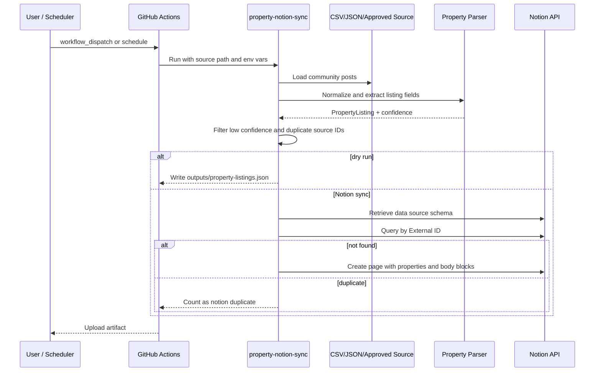
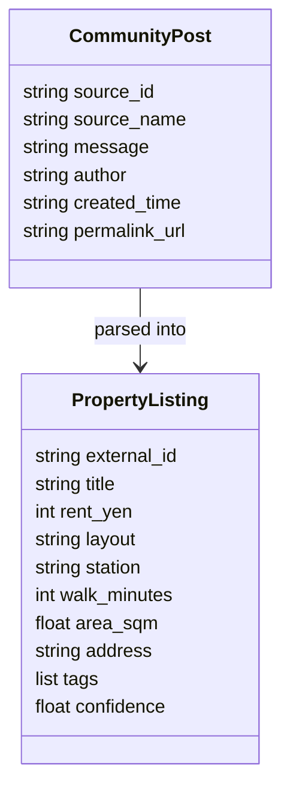

# Architecture

## Overview

This repository has two independent automations:

1. `facebook-auto-post`: posts approved content to a Facebook Page through the official Graph API Page feed endpoint.
2. `property-notion-sync`: collects property listing posts from approved community data exports and syncs structured listings to Notion.

The property sync pipeline is intentionally source-agnostic. Facebook Groups API access has been broadly removed by Meta, so this project avoids browser scraping and accepts data only from compliant sources such as CSV, JSON, internal exports, email parsers, webhooks, or explicitly approved APIs.

## Property sync flow

## Components

| Component | File | Responsibility |
|---|---|---|
| CLI | `src/facebook_auto_post/property_sync_cli.py` | Parses arguments/env and writes the JSON report |
| Sources | `src/facebook_auto_post/property_sources.py` | Loads CSV/JSON and optional approved Graph API responses |
| Parser | `src/facebook_auto_post/property_parser.py` | Extracts Japanese property fields and confidence score |
| Syncer | `src/facebook_auto_post/property_sync.py` | Filters, dedupes, and coordinates Notion writes |
| Notion client | `src/facebook_auto_post/notion_client.py` | Reads schema, checks duplicates, creates pages |
| Tests | `tests/` | Unit tests for posting, parsing, sources, Notion mapping, sync |

## Data model

## Security and compliance

- No Facebook credential storage in code.
- No browser automation or scraping of private Facebook group screens.
- All secrets are read from environment variables or GitHub Actions Secrets.
- Dry-run is the default for the Notion workflow.
- Notion rows are deduped by `外部ID` before creation.
